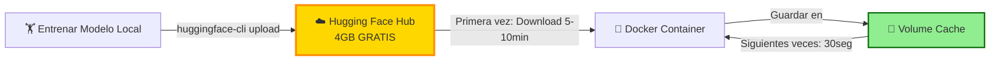
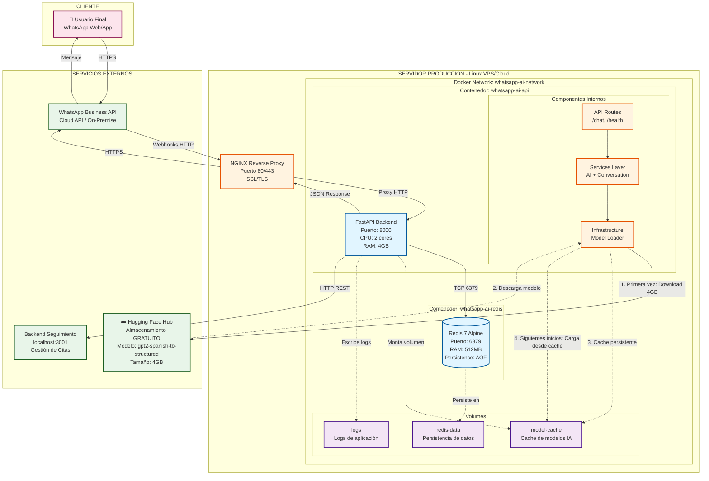
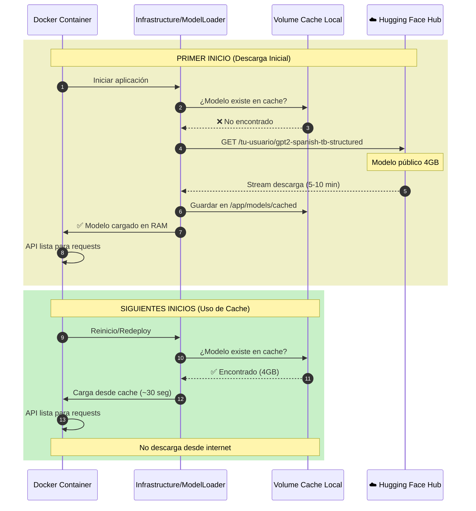
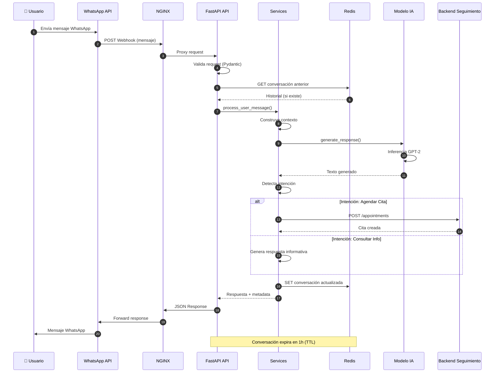
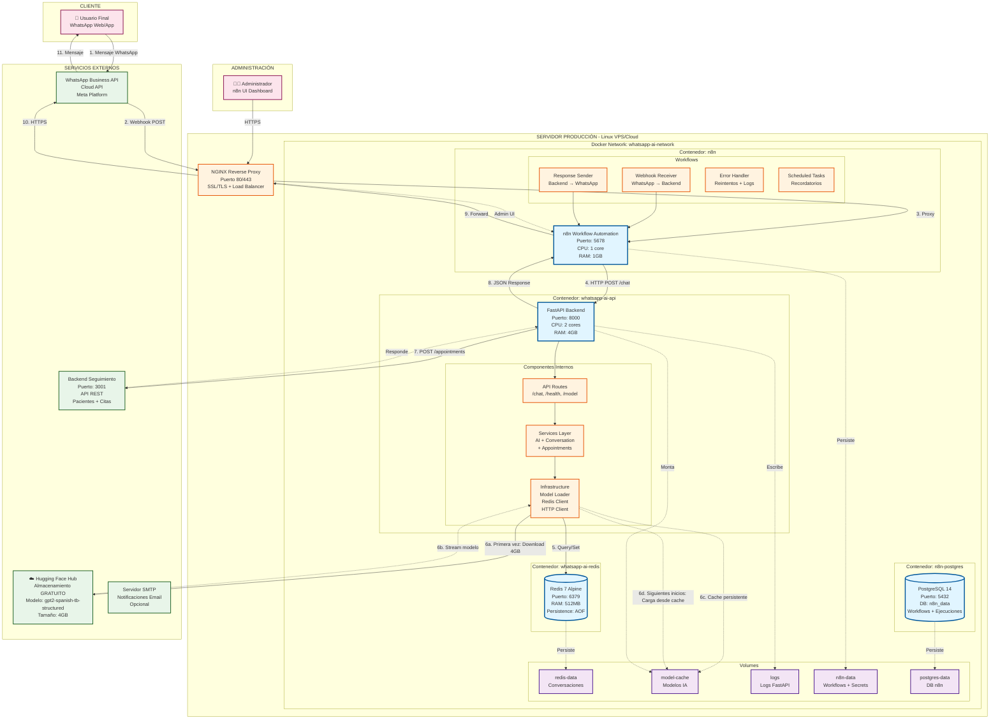
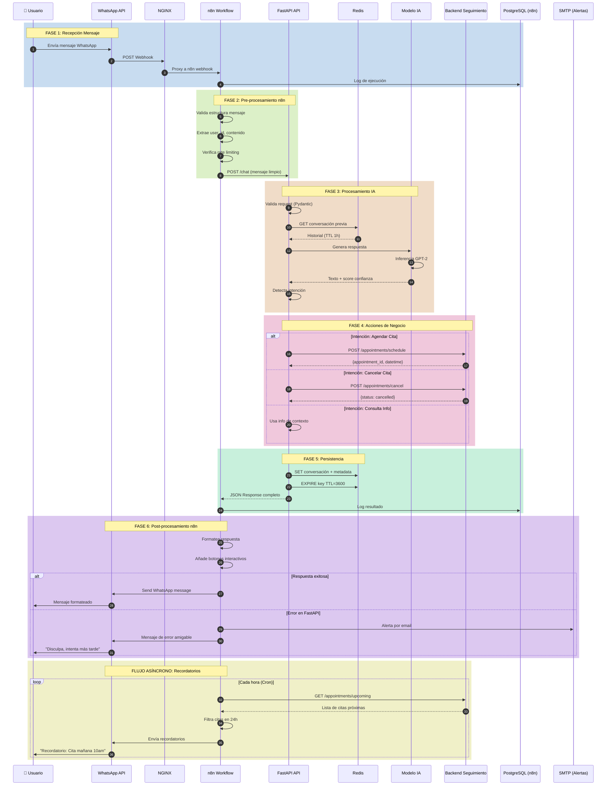
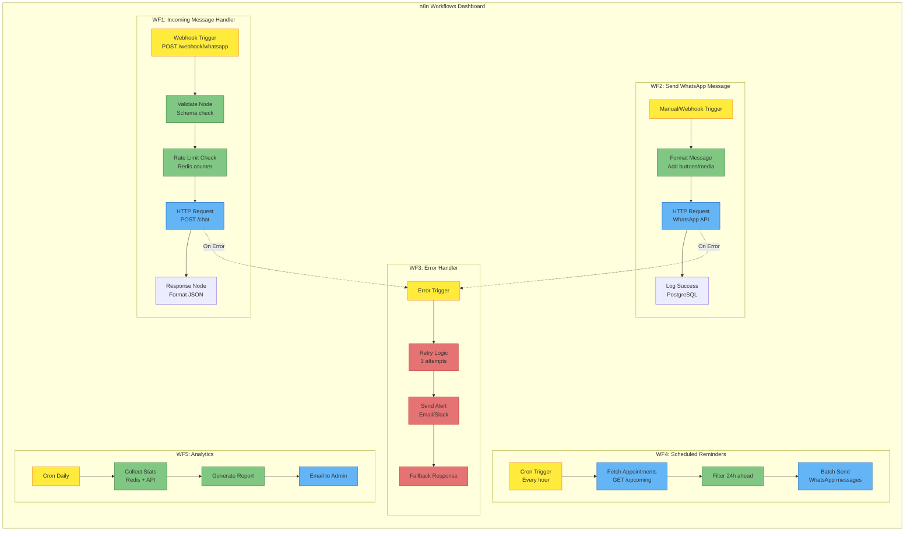

# 📊 DIAGRAMAS DE DESPLIEGUE - WhatsApp AI Assistant

Este documento presenta dos arquitecturas de despliegue para el sistema WhatsApp AI Assistant.

---

## 📑 Índice

1. [Versión 1: Sin n8n (Despliegue Simplificado)](#versión-1-sin-n8n)
2. [Versión 2: Con n8n (Despliegue Completo)](#versión-2-con-n8n)
3. [Gestión del Modelo en la Nube](#-gestión-del-modelo-en-la-nube)
4. [Comparación de Arquitecturas](#comparación-de-arquitecturas)
5. [Especificaciones Técnicas](#especificaciones-técnicas)
6. [Guía de Despliegue](#guía-de-despliegue)
7. [Actualizar el Modelo en Producción](#-actualizar-el-modelo-en-producción)

---

## 🎯 Resumen Ejecutivo

### Arquitectura del Modelo

Tu modelo GPT-2 fine-tuned (**4GB**) se almacena **GRATIS** en **Hugging Face Hub** y se descarga automáticamente al iniciar el contenedor Docker. Esto permite:

- ✅ **Costo $0**: Sin pagar almacenamiento cloud
- ✅ **Imagen Docker liviana**: Solo código, no incluye modelo
- ✅ **Deploys rápidos**: Cache local evita re-descargas
- ✅ **Fácil actualización**: Sube nueva versión y reinicia



📖 **Guía completa**: [GUIA_SUBIR_MODELO.md](GUIA_SUBIR_MODELO.md)

---

## 🔧 Versión 1: Sin n8n (Despliegue Simplificado)

### Diagrama de Despliegue



### Flujo de Descarga del Modelo



### Flujo de Datos Detallado



### Características de Esta Arquitectura

#### ✅ Ventajas
- **Simplicidad**: Solo 2 contenedores Docker
- **Bajo overhead**: No hay intermediarios adicionales
- **Fácil debugging**: Menos componentes que monitorear
- **Económico**: Menor consumo de recursos
- **Rápido de desplegar**: Setup en minutos

#### ❌ Limitaciones
- **Acoplamiento directo**: WhatsApp API debe conocer tu servidor
- **Sin orquestación visual**: No hay UI para gestionar flujos
- **Escalabilidad limitada**: Difícil añadir lógica compleja sin código
- **Mantenimiento**: Cambios requieren modificar código Python

#### 🎯 Casos de Uso Ideales
- MVP o prototipos rápidos
- Proyectos educativos
- Sistemas con lógica de negocio simple
- Equipos con expertise en Python/FastAPI
- Presupuesto limitado

---

## 📦 Gestión del Modelo en la Nube

### Subir Modelo a Hugging Face Hub (GRATIS)

Tu modelo fine-tuned se almacena gratuitamente en Hugging Face Hub y se descarga automáticamente al iniciar el contenedor.

#### Paso 1: Instalar Hugging Face CLI

```bash
# En tu entorno local (donde tienes el modelo entrenado)
pip install huggingface_hub
```

#### Paso 2: Autenticarse

```bash
# Login con tu cuenta de Hugging Face
huggingface-cli login

# Te pedirá tu token (obtenerlo de: https://huggingface.co/settings/tokens)
```

#### Paso 3: Subir el Modelo

```bash
# Navegar al directorio del modelo
cd app/training/models/gpt2-spanish-tb-structured

# Subir modelo a Hugging Face Hub
# Formato: tu-usuario/nombre-del-modelo
huggingface-cli upload tu-usuario/gpt2-spanish-tb-structured . \
  --repo-type model \
  --commit-message "Initial upload of fine-tuned GPT-2 for tuberculosis conversations"

# Ejemplo con usuario real:
# huggingface-cli upload Huarachi2002/gpt2-spanish-tb-structured . --repo-type model
```

#### Paso 4: Configurar Variables de Entorno

```env
# .env
# Cambiar a tu modelo en Hugging Face
MODEL_NAME=tu-usuario/gpt2-spanish-tb-structured
# Ejemplo: MODEL_NAME=Huarachi2002/gpt2-spanish-tb-structured

# Cache local para no descargar en cada inicio
MODEL_CACHE_DIR=/app/models
```

#### Paso 5: Código de Carga Automática

El código en `app/infrastructure/ai/model_loader.py` ya maneja esto:

```python
from transformers import AutoModelForCausalLM, AutoTokenizer

class ModelLoader:
    @classmethod
    def load_model(cls):
        model_name = os.getenv('MODEL_NAME')
        cache_dir = os.getenv('MODEL_CACHE_DIR', '/app/models')
        
        # Descarga automáticamente desde Hugging Face si no existe en cache
        model = AutoModelForCausalLM.from_pretrained(
            model_name,
            cache_dir=cache_dir,  # Persiste en volume Docker
            low_cpu_mem_usage=True
        )
        
        tokenizer = AutoTokenizer.from_pretrained(
            model_name,
            cache_dir=cache_dir
        )
        
        return model, tokenizer
```

### Ventajas de Este Enfoque

✅ **Gratuito**: Hasta 100GB de almacenamiento en Hugging Face  
✅ **Versionado**: Controla versiones de tu modelo  
✅ **CDN Global**: Descarga rápida desde cualquier región  
✅ **No afecta imagen Docker**: La imagen sigue siendo ligera  
✅ **Cache Persistente**: Solo descarga una vez, luego usa el volume local  
✅ **Actualización fácil**: Sube nueva versión y reinicia container  

### Flujo de Descarga

```
Primera vez:
Container inicia → No hay cache → Descarga desde Hugging Face (5-10 min) 
→ Guarda en volume → API lista

Siguientes veces:
Container reinicia → Cache existe → Carga desde volume local (30 seg) 
→ API lista
```

### Hacer el Modelo Público vs Privado

#### Modelo Público (Recomendado para este proyecto)
- ✅ Gratis
- ✅ Cualquiera puede usarlo
- ✅ Contribución a la comunidad
- ❌ Código del modelo es visible

```bash
# Al subir, es público por defecto
huggingface-cli upload tu-usuario/gpt2-spanish-tb-structured . --repo-type model
```

#### Modelo Privado
- ⭐ Requiere Hugging Face Pro ($9/mes)
- ✅ Solo tú puedes acceder
- ✅ Necesitas token de autenticación

```bash
# Subir como privado
huggingface-cli upload tu-usuario/gpt2-spanish-tb-structured . \
  --repo-type model \
  --private

# Configurar token en .env
HF_TOKEN=tu_token_aqui
```

```python
# Modificar model_loader.py para usar token
model = AutoModelForCausalLM.from_pretrained(
    model_name,
    cache_dir=cache_dir,
    use_auth_token=os.getenv('HF_TOKEN')
)
```

---

## 🚀 Versión 2: Con n8n (Despliegue Completo - RECOMENDADO)

### Diagrama de Despliegue



### Flujo de Datos Completo con n8n



### Arquitectura de n8n Workflows



### Características de Esta Arquitectura

#### ✅ Ventajas
- **Low-code**: Workflows visuales sin programar
- **Flexibilidad**: Fácil añadir integraciones (Slack, Email, DB, etc.)
- **Monitoreo**: UI para ver ejecuciones y errores
- **Escalabilidad**: n8n puede orquestar múltiples servicios
- **Automatización**: Tareas programadas (recordatorios, reportes)
- **Debugging**: Logs visuales de cada paso
- **Mantenimiento**: No-developers pueden modificar flujos
- **Integración rica**: 300+ nodos predefinidos

#### ❌ Desventajas
- **Complejidad**: Más componentes que gestionar
- **Recursos**: Requiere más RAM y CPU
- **Curva de aprendizaje**: Equipo debe aprender n8n
- **Costo**: Más contenedores = más $ en cloud

#### 🎯 Casos de Uso Ideales
- **Producción**: Sistemas que van a crecer
- **Equipos mixtos**: Developers + Business Analysts
- **Integraciones complejas**: Múltiples servicios externos
- **Automatización**: Workflows complejos y programados
- **Empresarial**: Necesidad de auditabilidad y monitoreo

---

## 📊 Comparación de Arquitecturas

| Característica | Sin n8n | Con n8n |
|----------------|---------|---------|
| **Componentes Docker** | 2 (API + Redis) | 4 (API + Redis + n8n + PostgreSQL) |
| **RAM Total** | ~4.5 GB | ~6.5 GB |
| **CPU Total** | 2.5 cores | 4 cores |
| **Complejidad Setup** | ⭐⭐ Baja | ⭐⭐⭐⭐ Media-Alta |
| **Mantenibilidad** | ⭐⭐⭐ Requiere Python | ⭐⭐⭐⭐⭐ Visual UI |
| **Escalabilidad** | ⭐⭐⭐ Limitada | ⭐⭐⭐⭐⭐ Excelente |
| **Debugging** | ⭐⭐⭐ Logs | ⭐⭐⭐⭐⭐ UI + Logs |
| **Integraciones** | ⭐⭐ Manual | ⭐⭐⭐⭐⭐ 300+ nodos |
| **Automatización** | ⭐⭐ Cron jobs | ⭐⭐⭐⭐⭐ Workflows |
| **Costo Mensual (AWS)** | ~$30-50 | ~$80-120 |
| **Tiempo Setup** | 30 min | 2-3 horas |
| **Ideal Para** | MVP, Prototipo | Producción |

---

## 🔧 Especificaciones Técnicas

### Versión 1: Sin n8n

#### Requisitos de Servidor
- **CPU**: 2-4 cores
- **RAM**: 6 GB mínimo (8 GB recomendado)
- **Disco**: 20 GB SSD
- **Bandwidth**: 100 GB/mes
- **OS**: Ubuntu 22.04 LTS

#### Puertos Requeridos
```
80/443  → NGINX (HTTP/HTTPS)
8000    → FastAPI (interno)
6379    → Redis (interno)
```

#### Variables de Entorno Clave
```env
# FastAPI
PORT=8000
# Modelo alojado en Hugging Face Hub (descarga automática)
MODEL_NAME=tu-usuario/gpt2-spanish-tb-structured
MODEL_CACHE_DIR=/app/models
REDIS_HOST=redis
SEGUIMIENTO_SERVICE_URL=http://host.docker.internal:3001

# Redis
REDIS_PORT=6379
CONVERSATION_TTL=3600

# (Opcional) Para modelos privados en Hugging Face
# HF_TOKEN=tu_token_aqui
```

#### Requisitos de Disco
- **20 GB SSD**: Sistema base + logs
- **+ 5-10 GB**: Cache del modelo (descargado de Hugging Face)
- **Total recomendado**: 30-40 GB

#### Tiempos de Inicio
- **Primer deploy**: 5-10 minutos (descarga modelo 4GB desde Hugging Face)
- **Deploys siguientes**: 30-60 segundos (usa cache local)

---

### Versión 2: Con n8n

#### Requisitos de Servidor
- **CPU**: 4-6 cores
- **RAM**: 10 GB mínimo (12 GB recomendado)
- **Disco**: 40 GB SSD
- **Bandwidth**: 200 GB/mes
- **OS**: Ubuntu 22.04 LTS

#### Puertos Requeridos
```
80/443  → NGINX (HTTP/HTTPS)
5678    → n8n UI (interno)
8000    → FastAPI (interno)
6379    → Redis (interno)
5432    → PostgreSQL (interno)
```

#### Variables de Entorno Adicionales
```env
# n8n
N8N_PORT=5678
N8N_PROTOCOL=https
N8N_HOST=yourdomain.com
DB_TYPE=postgresdb
DB_POSTGRESDB_HOST=postgres
DB_POSTGRESDB_PORT=5432
DB_POSTGRESDB_DATABASE=n8n
WEBHOOK_URL=https://yourdomain.com/webhook
EXECUTIONS_MODE=regular

# Modelo desde Hugging Face Hub
MODEL_NAME=tu-usuario/gpt2-spanish-tb-structured
MODEL_CACHE_DIR=/app/models
# HF_TOKEN=tu_token_aqui  # Solo si el modelo es privado
```

#### Requisitos de Disco
- **40 GB SSD**: Sistema base + logs + servicios
- **+ 5-10 GB**: Cache del modelo (descargado de Hugging Face)
- **Total recomendado**: 50-60 GB

#### Tiempos de Inicio
- **Primer deploy completo**: 10-15 minutos (incluye descarga modelo 4GB)
- **Deploys siguientes**: 1-2 minutos (usa cache local del modelo)

---

## 🚀 Guía de Despliegue

### Despliegue Versión 1 (Sin n8n)

#### 1. Preparar Servidor
```bash
# Actualizar sistema
sudo apt update && sudo apt upgrade -y

# Instalar Docker
curl -fsSL https://get.docker.com -o get-docker.sh
sudo sh get-docker.sh

# Instalar Docker Compose
sudo apt install docker-compose -y
```

#### 2. Clonar y Configurar
```bash
# Clonar repositorio
git clone <tu-repo>
cd fastapi-backend

# Configurar variables
cp .env.example .env
nano .env  # Editar según necesidad
```

#### 3. Desplegar
```bash
# Build y start
docker-compose up -d

# Verificar
docker-compose ps
docker-compose logs -f

# Verificar health
curl http://localhost:8000/health
```

#### 4. Configurar NGINX
```nginx
server {
    listen 80;
    server_name yourdomain.com;

    location / {
        proxy_pass http://localhost:8000;
        proxy_set_header Host $host;
        proxy_set_header X-Real-IP $remote_addr;
    }
}
```

#### 5. Configurar SSL
```bash
sudo apt install certbot python3-certbot-nginx
sudo certbot --nginx -d yourdomain.com
```

---

### Despliegue Versión 2 (Con n8n)

#### 1-3. Igual que Versión 1

#### 4. Crear docker-compose.yml extendido
```bash
# Añadir servicios n8n y postgres al docker-compose.yml
nano docker-compose.yml
```

#### 5. Desplegar Stack Completo
```bash
docker-compose up -d

# Verificar todos los servicios
docker-compose ps

# Logs
docker-compose logs -f n8n
docker-compose logs -f api
```

#### 6. Configurar n8n
```bash
# Acceder a n8n UI
https://yourdomain.com:5678

# Primera configuración:
# 1. Crear usuario admin
# 2. Importar workflows desde /n8n-workflows
# 3. Configurar credenciales WhatsApp
```

#### 7. Configurar NGINX para n8n
```nginx
# API Backend
server {
    listen 80;
    server_name api.yourdomain.com;

    location / {
        proxy_pass http://localhost:8000;
        proxy_set_header Host $host;
    }
}

# n8n UI
server {
    listen 80;
    server_name n8n.yourdomain.com;

    location / {
        proxy_pass http://localhost:5678;
        proxy_set_header Host $host;
        proxy_set_header X-Real-IP $remote_addr;
        proxy_set_header Upgrade $http_upgrade;
        proxy_set_header Connection "upgrade";
    }
}
```

#### 8. Importar Workflows
```bash
# Los workflows están en n8n-workflows/ del repositorio
# Importar desde n8n UI: Settings → Import Workflow
```

---

## 📈 Monitoreo y Mantenimiento

### Comandos Útiles

```bash
# Ver logs en tiempo real
docker-compose logs -f

# Reiniciar servicio específico
docker-compose restart api

# Ver uso de recursos
docker stats

# Backup Redis
docker exec whatsapp-ai-redis redis-cli SAVE
docker cp whatsapp-ai-redis:/data/dump.rdb ./backup/

# Backup PostgreSQL (solo v2)
docker exec n8n-postgres pg_dump -U postgres n8n > backup.sql

# Limpiar recursos no usados
docker system prune -a
```

### Health Checks

```bash
# API Health
curl http://localhost:8000/health

# Redis Health
docker exec whatsapp-ai-redis redis-cli ping

# n8n Health (solo v2)
curl http://localhost:5678/healthz
```

---

## 🎯 Recomendación Final

### Para Desarrollo/MVP
➡️ **Usa Versión 1 (Sin n8n)**
- Más simple
- Menos recursos
- Rápido de iterar

### Para Producción
➡️ **Usa Versión 2 (Con n8n)**
- Más robusto
- Mejor mantenibilidad
- Escalable a futuro

---

## 📞 Soporte

Para dudas sobre despliegue:
1. Revisa logs: `docker-compose logs`
2. Verifica health checks
3. Consulta documentación específica:
   - [DOCKER_README.md](DOCKER_README.md)
   - [INICIO_RAPIDO.md](INICIO_RAPIDO.md)

---

## 🔄 Actualizar el Modelo en Producción

### Escenario: Has mejorado tu modelo y quieres actualizarlo

#### Opción 1: Subir Nueva Versión a Hugging Face

```bash
# En tu máquina local con el modelo mejorado
cd app/training/models/gpt2-spanish-tb-structured

# Subir nueva versión
huggingface-cli upload tu-usuario/gpt2-spanish-tb-structured . \
  --repo-type model \
  --commit-message "v2.0: Improved accuracy with 5000 samples"

# En el servidor de producción
docker-compose down
docker-compose exec api rm -rf /app/models/*  # Limpiar cache
docker-compose up -d  # Descarga nueva versión automáticamente
```

#### Opción 2: Usar Versionado de Hugging Face

```bash
# Subir con tag específico
huggingface-cli upload tu-usuario/gpt2-spanish-tb-structured . \
  --repo-type model \
  --revision v2.0

# En .env del servidor
MODEL_NAME=tu-usuario/gpt2-spanish-tb-structured
MODEL_REVISION=v2.0  # Especificar versión
```

### Monitoreo de Descarga del Modelo

```bash
# Ver logs durante la descarga inicial
docker-compose logs -f api

# Verás algo como:
# Downloading: 100%|██████████| 4.2GB/4.2GB [05:30<00:00, 12.7MB/s]
# Model loaded successfully from cache

# Verificar cache del modelo
docker-compose exec api ls -lh /app/models/
```

### Troubleshooting Común

#### Problema: Modelo no se descarga

```bash
# Verificar conectividad a Hugging Face
docker-compose exec api curl -I https://huggingface.co

# Verificar variables de entorno
docker-compose exec api env | grep MODEL

# Verificar espacio en disco
docker-compose exec api df -h
```

#### Problema: Cache corrupto

```bash
# Limpiar cache y re-descargar
docker-compose down
docker volume rm whatsapp-ai-model-cache
docker-compose up -d
```

#### Problema: Timeout en descarga

```bash
# Aumentar timeout en docker-compose.yml
# healthcheck:
#   start_period: 600s  # 10 minutos para descarga lenta
```

---

## 📊 Comparación: Local vs Cloud Storage para Modelo

| Aspecto | Modelo en Imagen Docker | Modelo en Hugging Face | Modelo en S3/Spaces |
|---------|-------------------------|------------------------|---------------------|
| **Costo Almacenamiento** | $0 (incluido en imagen) | **$0 (gratis hasta 100GB)** | $5/mes |
| **Costo Transferencia** | Incluido en registry | **$0 (gratis)** | $0.01/GB |
| **Tiempo Build** | 30+ min | N/A | N/A |
| **Tiempo Deploy** | 20+ min (pull image) | **5-10 min (primera vez)** | 3-5 min (primera vez) |
| **Tiempo Re-deploy** | 20+ min | **30 seg (usa cache)** | 30 seg (usa cache) |
| **Versionado** | Tags de Docker | **Git-like (commits)** | Manual |
| **Colaboración** | Docker registry | **Público/comunidad** | Privado |
| **Facilidad Update** | Rebuild completo | **Push con CLI** | Upload manual |
| **Recomendado** | ❌ NO para modelos >1GB | **✅ SÍ (mejor opción)** | ✅ Para modelos privados |

---

## 🎓 Mejores Prácticas

### 1. Usa Hugging Face Hub para Modelos
```bash
# ✅ Correcto - Modelo en la nube
MODEL_NAME=tu-usuario/gpt2-spanish-tb-structured

# ❌ Evitar - Modelo en imagen Docker (para modelos >500MB)
COPY app/training/models/gpt2-spanish-tb-structured /app/models/
```

### 2. Implementa Cache Persistente
```yaml
# docker-compose.yml
volumes:
  - model-cache:/app/models  # ✅ Cache persiste entre deploys
```

### 3. Monitorea el Espacio en Disco
```bash
# Cron job para limpiar cache viejo
0 0 * * 0 docker system prune -f  # Cada domingo a medianoche
```

### 4. Documenta tu Modelo en Hugging Face
Crea un `README.md` en tu repositorio de Hugging Face:

```markdown
---
license: apache-2.0
language: es
tags:
- conversational
- tuberculosis
- medical
- spanish
datasets:
- custom-tuberculosis-dataset
---

# GPT-2 Spanish Fine-tuned para Asistencia en Tuberculosis

Este modelo ha sido fine-tuned para conversaciones médicas sobre tuberculosis
en español, específicamente para el centro médico CAÑADA DEL CARMEN.

## Uso

```python
from transformers import AutoModelForCausalLM, AutoTokenizer

model = AutoModelForCausalLM.from_pretrained("tu-usuario/gpt2-spanish-tb-structured")
tokenizer = AutoTokenizer.from_pretrained("tu-usuario/gpt2-spanish-tb-structured")
```

## Métricas

- Perplexity: X.XX
- BLEU Score: X.XX
- Training samples: 4000+
```

---

**Última actualización**: Octubre 2025  
**Versión**: 2.0 - Actualizado con gestión de modelos en la nube  
**Mantenido por**: Equipo de Desarrollo WhatsApp AI Assistant
